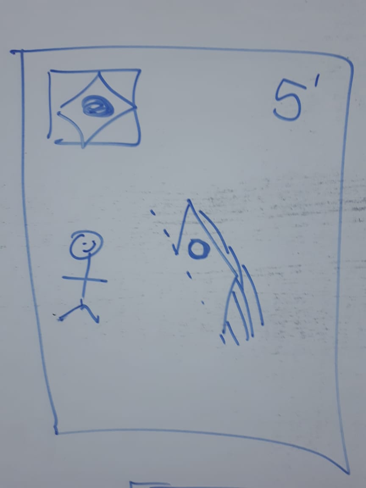
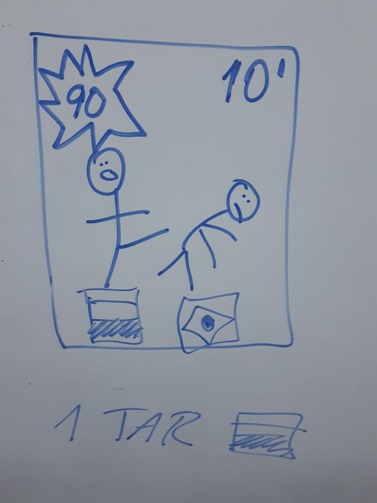
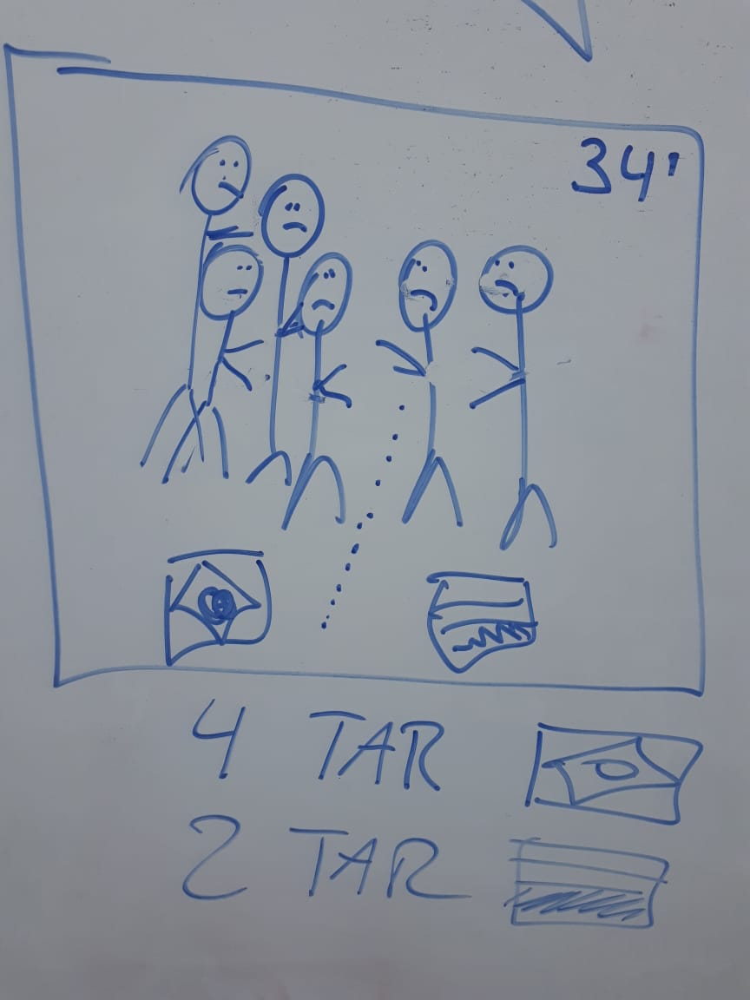
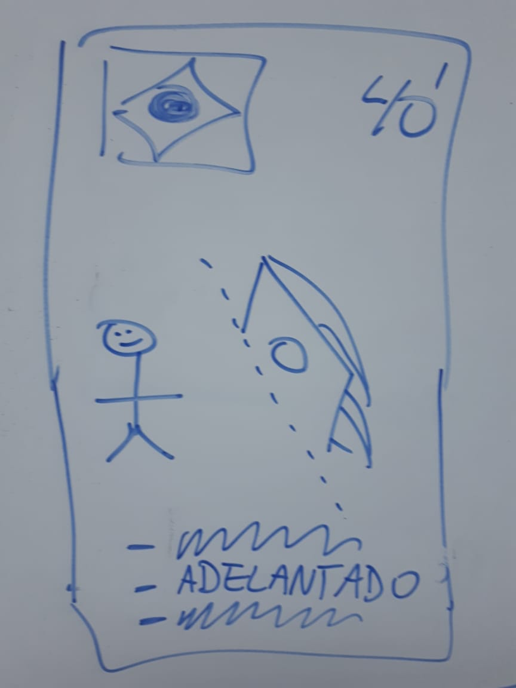
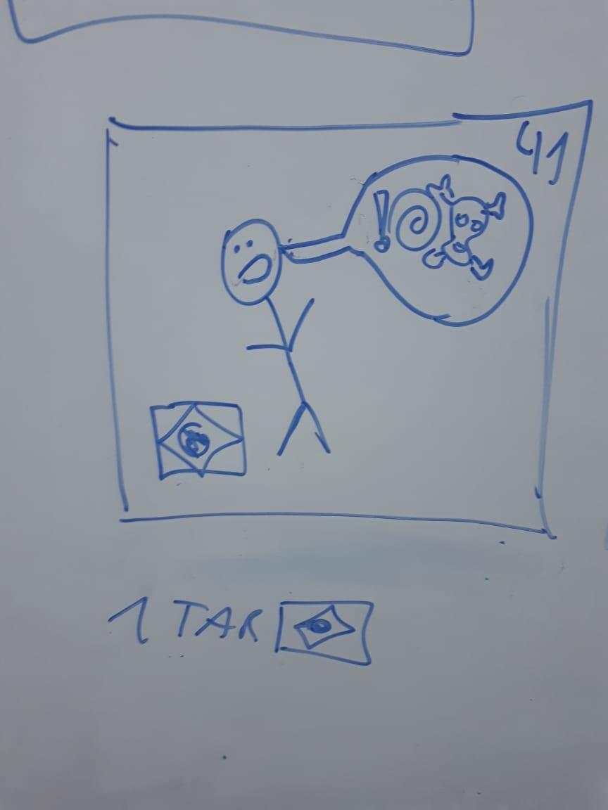
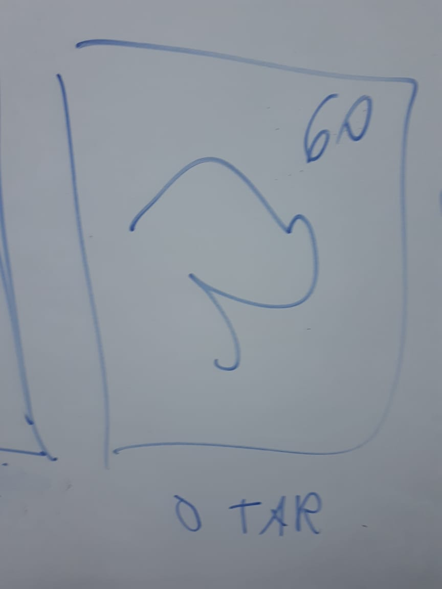
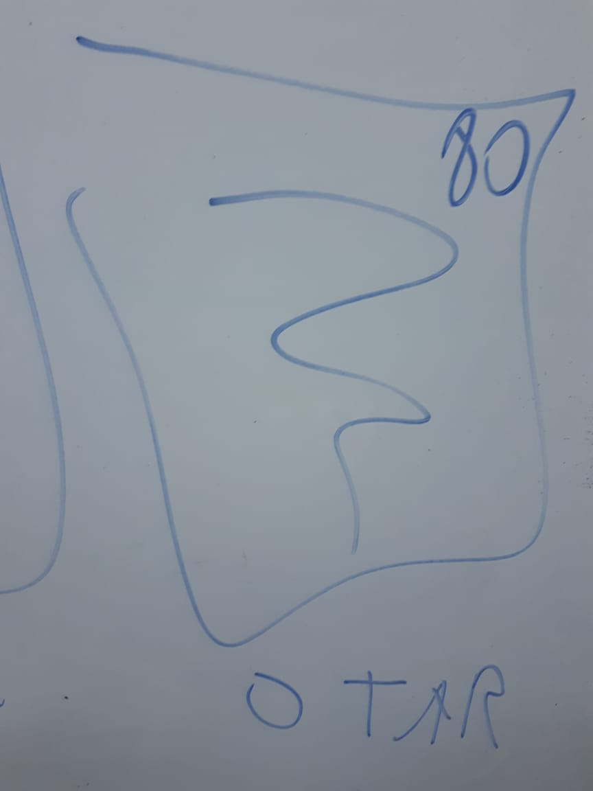
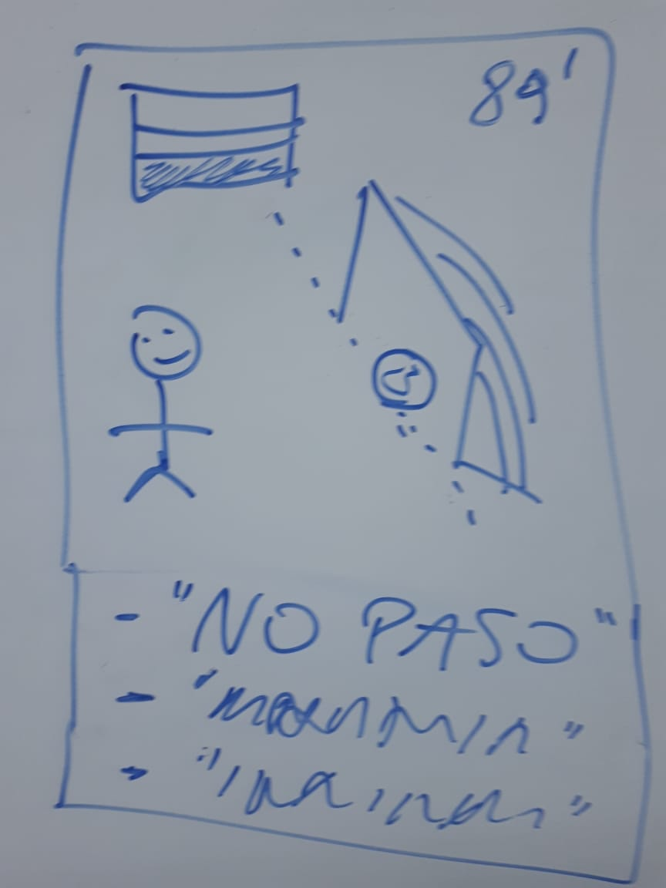

# El VAR 
## Ejercicio integrador tipo parcial

**Sistema para analizar jugadas dudosas, goles y tarjetas.**

### 1) Jugadas de gol
Antes, cuando la pelota entraba en el arco, el árbitro decidía en el momento si era gol o había algún motivo para no convalidarlo, ahora hay que esperar a que el VAR diga si es un gol o no. 

De la jugada se conoce el equipo que convirtió el supuesto gol, el último jugador en tocar la pelota, el minuto de partido en el que sucedió y una serie de circunstancias especiales que describen la situación y le permitirán decidir al VAR.

De esta manera, una de las principales funcionalidades del VAR es decir si la jugada termina en gol o no. Como sospechan los críticos de la tecnología, el VAR no se comporta siempre con neutralidad sino que puede estar "arreglado", es decir que según en qué modo de funcionamiento se lo configura, permite obtener diferentes veredictos.

Su operatoria es la siguiente:

* Si la jugada no tiene circunstancias especiales, rápidamente convalida el gol.
* Si la jugada tiene circunstancias especiales, el veredicto depende del modo de funcionamiento que tenga en ese momento. Algunos de los modos conocidos son los siguientes:
  * justicia ciega: analiza las circunstancias, si alguna de ellas es "la pelota no pasó completamente la línea", "jugador adelantado" o "fue con la mano", el gol no es válido.
  * fifa: el resultado depende del equipo que convierte el supuesto gol. Si es uno de los que ganó mundiales, el gol se convalida. Si no, no.
  * más goles: Busca favorecer que el marcador aumente, por lo que siempre convalida el gol.

#### Los requerimientos son:

1. Saber si una jugada en que la pelota entra en el arco, realmente es gol, de acuerdo a la configuracion actual
2. Configurar en VAR de manera de cambiar su modo de funcionamiento (para que en un uso posterior actúe de otra manera) 

### 2) Tarjetas
En un partido, además de las jugadas de gol, se registran otras jugadas importantes, tales como:
* Falta. Se registra el jugador que comete la falta y al que se la cometen. También se conoce el minuto del partido y la intensidad de la falta. 
* Pelea en la cancha. Se registra una lista con los jugadores de que intervienen en la pelea, y el minuto del partido.
* Insultos. Se indica qué jugador insultó al referí y qué le dijo, y el minuto del partido.

Segun la gravedad de la jugada, puede que se saquen tarjetas a los involucrados.

* Falta. Se saca tarjeta si la intensidad de la falta es mayor a 75.
* Pelea en la cancha. Si es una pelea en la que intervienen muchos jugadores (más de 5) y de los dos equipos, se les saca tarjeta a todos. 
* Insultos. Si usó la palabra agresiva a la madre del referí, se le saca tarjeta.
* En las jugadas de gol, se saca tarjeta si en las circunstancias de la jugada se tiene conocimiento que el jugador festejó quitándose la camiseta.

#### El requerimiento es saber cuántas tarjetas se sacaron a cada equipo en un partido.

### 3) El partido
Tambíen se quiere saber algunas estadísticas del partido:
Los puntos que hace un equipo en ese partido (3 si gano, 0, si perdio, 1 si empato) 
Si el segundo tiempo tuvo más jugadas registradas que el primer tiempo (asumir minuto 45)

### 4) Ejemplos y pruebas
Construir dos tests, uno donde una jugada con un determinado modo de funcionamiento del var no sea gol, y otro donde la misma jugada, con otro modo, sí lo sea. 
Testear un partido con el VAR fifa en el que brasil le gana a paraguay 2 a 0, a brasil le sacan 5 tarjetas y a paraguay 3.

### 5) Para explicar
Justificar la utilidad del concepto de polimorfismo y de la herencia en la solución

### Ejemplo de desarrollo de un partido
(Con VAR en modo fifa)

Jugada de gol de Brasil:
5' El gol vale, porque no hay situaciones especiales

10' Falta de mucha intensidad. Tarjeta para Paraguay

34' Pelea multitudinaria entre ambos equipos. Tarjetas para todos, 4 Brasil y 2 Paraguay

Jugada de gol de Brasil:
40' El gol vale, porque Brasil ganó mundiales, en modo justicia no vale porque está adelantado. 

41' Insulto al referí con palabras inapropiadas. Tarjeta para Brasil

60' Jugada cualquiera, que no corresponde tarjeta ni gol

80' Jugada cualquiera, que no corresponde tarjeta ni gol

Jugada de gol de Paraguay:
89' El gol no vale, porque Paraguay no ganó mundiales, en modo justicia tampoco, porque no pasó la pelota. 

**Resultado esperado del partido con VAR fifa:**
Gana brasil 2 a 0

**Con otros modos de VAR:**

* Con VAR justicia ciega, un gol de Brasil se anula y termina 1 a 0
* Con VAR mas goles, el gol de Paraguay se convalida y termina 2 a 1

